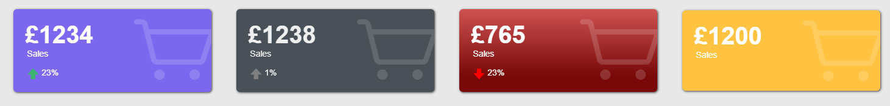

# Oracle-Apex-Responsive-KPI-Cards
Responsive KPI Cards Template Plugin

Create KPI cards with this template component plugin - 
Responsive and will colapse down to a single column on smaller screens

## Installation
Import template_component_plugin_milo_responsive_kpi_cards.sql file into your applications plugins.

## Usage
Create a page item
Choose Responsive KPI Cards [Plugin] as an template component type

## Screenshot


## Example Query
```sql
Select  'MediumSlateBlue' AS BG_COLOR
    ,   'White' AS FG_COLOR
    ,   'fa-shopping-cart' AS CARD_ICON
    ,   '£1234' AS CARD_VALUE
    ,   'Sales' AS CARD_TEXT
    ,   'MediumSeaGreen' AS STATUS_ICON_COLOR
    ,   'fa-arrow-up-alt' AS STATUS_ICON
    ,   '23%' AS STATUS_TEXT
from dual
union all 
Select  '#495057' AS BG_COLOR
    ,   '#efefef' AS FG_COLOR
    ,   'fa-shopping-cart' AS CARD_ICON
    ,   '£1238' AS CARD_VALUE
    ,   'Sales' AS CARD_TEXT
    ,   'Gray' AS STATUS_ICON_COLOR
    ,   'fa-arrow-up-alt' AS STATUS_ICON
    ,   '1%' AS STATUS_TEXT
from dual
union all 
Select  'linear-gradient(180deg, rgba(207,82,82,1) 0%, rgba(121,9,9,1) 80%)' AS BG_COLOR
    ,   '#fff' AS FG_COLOR
    ,   'fa-shopping-cart' AS CARD_ICON
    ,   '£765' AS CARD_VALUE
    ,   'Sales' AS CARD_TEXT
    ,   'red' AS STATUS_ICON_COLOR
    ,   'fa-arrow-down-alt' AS STATUS_ICON
    ,   '23%' AS STATUS_TEXT
from dual
union all 
Select  '#ffc241' AS BG_COLOR
    ,   '#fff' AS FG_COLOR
    ,   'fa-shopping-cart' AS CARD_ICON
    ,   '£1200' AS CARD_VALUE
    ,   'Sales' AS CARD_TEXT
    ,   'White' AS STATUS_ICON_COLOR
    ,   'fa-arrows-h' AS STATUS_ICON
    ,   NULL AS STATUS_TEXT
from dual
```
### Based on: https://codepen.io/ricardomaia/pen/BajKLmE

